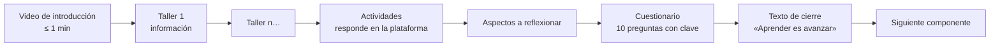
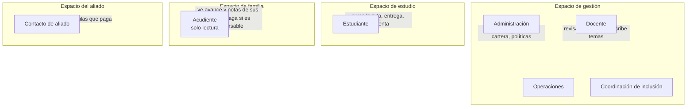
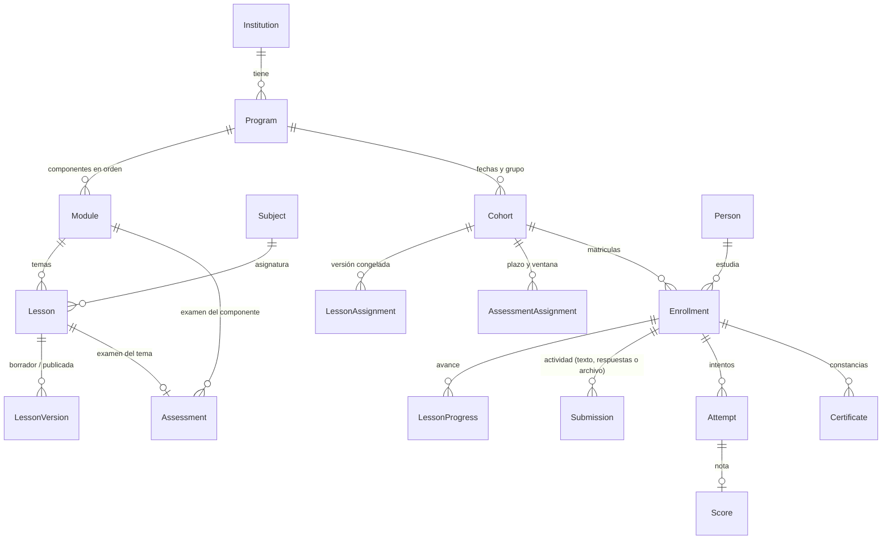
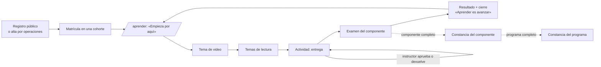
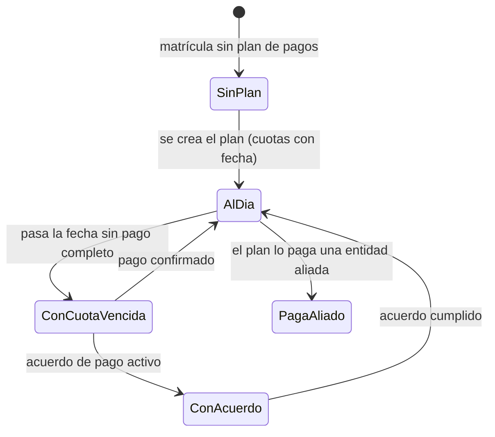

# Colombia Estudia — resumen de negocio y de lo que la plataforma tiene hoy

Escrito el 24/9/2026 a partir del plan de inicio de actividades de los clientes (23/9),
su nota de voz del 24/9 y el estado del producto en `docs/estado.md`. Es el mapa para
quien llega nuevo; la verdad técnica sigue en `reference/`.

## 1. El negocio

**Qué vende.** Validación del bachillerato para jóvenes y adultos que lo dejaron a medias,
100 % virtual, por **componentes** (antes «módulos»): una unidad de contenido que se cursa
en más o menos un mes, aunque la gente va a su ritmo. Reemplaza a Valida YA, el producto
anterior.

**Cómo se estructura un componente** (nota de voz del 24/9):

El primer componente («Gestión emocional y riesgos psicosociales») es gratis y aparece al
crear la cuenta: el registro público matricula en la cohorte de introducción que la
institución designe (`Institution.settings.introCohortId`,
`features/auth/server/registration.service.ts`); después vienen 10 más.

**Programas y precios** (plan del 23/9): bachillerato por grado de entrada (6.º a 8.º
$120.000 c/m, 9.º a 11.º $90.000 c/m; «c/m» por confirmar: mes o componente), y a
proyectar inglés, técnicos laborales (alianza con el Politécnico de Cundinamarca),
refuerzos académicos, pre-ICFES y pregrado (solo por alianza: no son IES).

**Calendario.** Cuatro ceremonias de graduación al año: octubre, diciembre, marzo y julio.

**Quién paga.** El estudiante adulto, su acudiente (menores) o una entidad aliada. Regla
no negociable: la mora nunca toca el acceso académico de un menor.

**Pendiente del lado del negocio.** Licencia de funcionamiento y registro del programa ante
la Secretaría de Educación (educación formal de adultos), registro mercantil y
representación legal, cuenta y pasarela de pagos, nombre nuevo (relacionado con «Alba»),
línea telefónica, redes.

## 2. Quién usa la plataforma

Una persona puede tener varios roles y cambia de espacio con el selector de la barra.
Los roles de gestión entran con verificación en dos pasos.

## 3. Cómo se modela el contenido y el estudio

Lo que importa de este dibujo: la cohorte **congela** la versión publicada de cada tema
(`LessonAssignment`), así que corregir un tema no cambia lo que ve una cohorte abierta
salvo que el staff lo reasigne; las instrucciones y las preguntas de una actividad sí se
corrigen en caliente. El avance se calcula desde `LessonProgress`, `Submission` y `Score`,
nunca se guarda a mano.

## 4. La ruta de un estudiante, de punta a punta

Cada pantalla del estudiante responde tres preguntas: qué hago ahora, qué pasa con lo que
hice, qué viene después. La secuencia se desbloquea por completado (un tema, después el
siguiente; el examen del componente al final), y nunca por pago en el caso de un menor.

## 5. Cómo se cobra

El estado se calcula al momento desde las cuotas y los pagos; el estudiante lo ve en una
frase («Tienes una cuota vencida desde el 18 de septiembre: te faltan $ 200.000»), el
acudiente responsable igual, y el staff en `/cartera`. Pago en línea (Wompi) cuando esté
configurado; siempre «Datos para transferencia». La política de la institución decide si
un adulto con cuotas vencidas necesita acuerdo para matricularse en una cohorte nueva.

## 6. Lo que la plataforma tiene hoy (24/9)

Gestión: programas con componentes (tabla con filas expandibles), asignaturas, temas con
versiones y actividad (instrucciones, qué se entrega, preguntas para responder en la
plataforma), exámenes con preguntas y clave, cohortes con ruta congelada, matrículas por
importación o a mano, personas e invitaciones, cartera con planes, cuotas, pagos y acuerdos,
políticas, notificaciones, portada `/inicio` con lo que requiere atención y el recorrido del
estudiante medido con telemetría.

Estudiante: `/aprender` como «hoy» con la ruta resumida, modo tarea en el celular,
reproductor con evidencia mínima, actividades con borrador guardado y espera visible,
exámenes con intento reanudable y resultados en tarjetas, cuenta en lenguaje de persona,
avisos con una acción por tipo, calendario como agenda, biblioteca, constancias.

Familia: pupilos con avance, notas y cuotas si es responsable de pago. Aliado: sus
matrículas. Acceso: registro público con matrícula automática en la cohorte de
introducción, invitaciones, contraseña o enlace mágico, dos pasos para el staff.

## 7. Decisiones abiertas

- «c/m»: cobro por mes o por componente; con «por componente», el plan de pagos cambia.
- Designar la cohorte de introducción (`introCohortId`) cuando el componente gratis esté
  cargado; sin ella, el registro crea la cuenta sin matrícula.
- Qué se guarda de las actividades con contenido emocional (consigna y conservación).
- Cuotas en el calendario del estudiante (hoy no van).
- Nombre nuevo de la marca.
- Licencia y registro ante la Secretaría de Educación.
