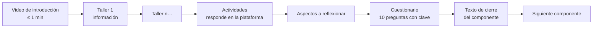
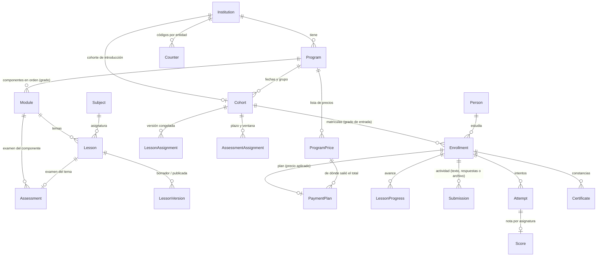

# Colombia Estudia — brief de negocio, cómo se construyó el schema y qué soporta hoy

Versión del 25/9/2026 (sustituye a la del 24/9). Fuentes: reunión con los clientes del
20/9, plan de inicio de actividades del 23/9, nota de voz del 24/9, WhatsApp del 25/9 y el
estado del producto en `docs/estado.md`. Es el mapa para quien llega nuevo; la verdad
técnica sigue en `reference/` y las decisiones cerradas en `PRODUCT_DECISIONS.md`.

## 1. Brief de negocio

**Qué vende.** Validación del bachillerato para jóvenes y adultos que lo dejaron a medias,
100 % virtual, organizada en **componentes** (los clientes no dicen «módulo»): una unidad
de contenido de más o menos un mes, aunque cada quien va a su ritmo. El producto anterior
era Valida YA; el nombre nuevo está por decidir (algo relacionado con «Alba»).

**A quién.** Adultos que trabajan de día y estudian de noche, y menores de edad con
acudiente. Cuatro puertas de entrada al bachillerato según el grado desde el que se entra:
quien entra desde 6.º ve los 10 componentes, desde 8.º ve 8, desde 10.º ve 6; se cobra más
a quien ve más. Ciclos legales: 3 = 6.º–7.º, 4 = 8.º–9.º, 5 = 10.º, 6 = 11.º, mínimo seis
meses por ciclo.

**Cómo se estudia un componente** (nota de voz del 24/9):

```mermaid
flowchart LR
  I[Video de introducción<br/>≤ 1 min] --> T1[Taller 1<br/>información]
  T1 --> T2[Taller n…]
  T2 --> A[Actividades<br/>responde en la plataforma]
  A --> R[Aspectos a reflexionar]
  R --> Q[Cuestionario<br/>10 preguntas con clave]
  Q --> C[Texto de cierre<br/>del componente]
  C --> N[Siguiente componente]
```

**Lo gratis y lo de pago.** El primer componente («Gestión emocional y riesgos
psicosociales») es la promoción: gratis, aparece al crear la cuenta, y un menor de edad se
inscribe solo. Los programas de pago exigen acudiente para un menor. Precios del
bachillerato: 6.º a 8.º $120.000 c/m, 9.º a 11.º $90.000 c/m; el «c/m» (por mes o por
componente) sigue sin decidirse.

**Qué más quieren vender.** Inglés (sincrónico, fuera de la plataforma, solo promoción),
técnicos laborales (alianza con el Politécnico de Cundinamarca, ~60–70 programas, solo
nombres y redirección), refuerzos académicos, pre-ICFES y pregrado (solo por alianza: no son
institución de educación superior).

**Quién paga y qué pasa si no paga.** El estudiante adulto, su acudiente o una entidad
aliada. Los clientes quieren que la nota se vea solo con la mensualidad pagada y desbloquear
componentes a medida que pagan; la decisión de cobro está aplazada a la fase de finanzas y a
asesoría jurídica. Regla no negociable de la plataforma: **la mora nunca toca el acceso
académico de un menor**.

**Calendario y operación.** Cuatro ceremonias de graduación al año (octubre, diciembre,
marzo, julio). Pago hoy por WhatsApp. Pendientes del negocio: licencia y registro del
programa ante la Secretaría de Educación, registro mercantil y representación legal, cuenta
y pasarela de pagos, línea telefónica, redes.

**Prioridad que dieron.** Primero que el administrador funcione tal cual el negocio; el
diseño después. Les gusta la interfaz actual.

## 2. Vocabulario, con analogía de colegio

| Plataforma | Colegio                                        | Qué decide                                             |
| ---------- | ---------------------------------------------- | ------------------------------------------------------ |
| Programa   | La titulación («Bachillerato», «Introducción») | Ruta, tipo, gratis o de pago, precios                  |
| Componente | **El curso que se toma** (cliente, 25/9)       | Orden en la ruta, grado, descripción, cierre           |
| Tema       | La clase                                       | Contenido versionado, actividad                        |
| Examen     | El examen                                      | Preguntas, clave, reglas del intento                   |
| Asignatura | La materia del boletín («Matemáticas»)         | De qué materia cuenta la nota                          |
| Cohorte    | El grupo («11-A de 2026»)                      | Quiénes y cuándo; contenido congelado                  |
| Matrícula  | El puesto de una persona en el grupo           | Acceso, grado de entrada, cartera, avance, constancias |

**Programa** es qué se vende, **componente** es el curso que el estudiante elige y toma
(así lo llama el cliente: «los componentes son los cursos»), **cohorte** es a quién y cuándo,
**asignatura** es de qué materia cuenta la nota; el tema es la clase. En `/aprender` el
catálogo lista componentes, no programas; la matrícula, eso sí, sigue siendo por cohorte,
entrando por el componente elegido (decisión abierta en §5). La cohorte de introducción es
un caso raro: un solo grupo abierto para siempre donde cada uno entra cuando se registra
(funciona porque el acceso cuenta desde la matrícula de cada uno).

## 3. Cómo se construyó el schema

**Principios que no se negociaron desde el día 1** (`reference/05-database/schema.md`):

1. **Multi-tenant serio**: `institutionId` en toda tabla salvo `Institution`, un cliente
   Prisma que lo inyecta en cada consulta, RLS en Postgres y un rol `app_writer` sin
   UPDATE/DELETE sobre las tablas de rastro (`LearningEvent`, `AuditLog`, append-only).
2. **Contenido versionado e inmutable**: un tema o examen publicado no cambia; se corrige
   en una versión nueva. La cohorte congela la versión que estudia (`LessonAssignment`,
   `AssessmentAssignment`), así que corregir no altera lo que un grupo tiene entre manos.
3. **Lo derivado no se guarda**: el estado de cartera se calcula desde cuotas y pagos; el
   avance, desde `LessonProgress`, `Submission` y `Score`. Nada de columnas «estado» que se
   desactualizan.
4. **La clave del examen viaja aparte**: `AssessmentVersion.answerKey` nunca sale con el
   examen; la corrige el servidor.
5. **Datos personales con cuidado**: `isMinorAtEnrollment` es una foto al matricular y de
   ahí salen acudencia, consentimiento y la política de acceso; sin diagnósticos de salud en
   la base; PII enmascarada y auditada al leerla.
6. **Accesibilidad como regla de datos**: un video no se publica sin subtítulos revisados o
   transcripción (`MediaAsset.captionsSource`).

**Cómo fue creciendo**, en el orden en que el negocio se fue conociendo:

| Cuándo                   | Qué se supo                                             | Qué entró al schema                                                                                                                                                                                   |
| ------------------------ | ------------------------------------------------------- | ----------------------------------------------------------------------------------------------------------------------------------------------------------------------------------------------------- |
| Fase 0–1 (sep)           | Un LMS con cohortes, cartera y familia                  | El núcleo: personas y roles, programas/módulos/temas/exámenes versionados, cohortes y asignaciones, avance, intentos, notas, cartera (plan, cuotas, pagos, acuerdos), constancias, auditoría, eventos |
| 20/9 — reunión           | Examen por tema, grado de entrada                       | `Assessment.lessonId`, `Enrollment.startsAtModule`                                                                                                                                                    |
| 23/9 — Fases B y C       | Registro público, acudiente con su propia cuenta        | `settings.introCohortId` (JSON), capacidad `progress.read.ward`, área `/familia`                                                                                                                      |
| 24/9 — nota de voz       | Respuestas en la plataforma, «componente»               | `Lesson.activityPrompts`, `Submission.answers`                                                                                                                                                        |
| 25/9 — códigos           | «Un ID como en Basikon»                                 | `Counter` + trigger `assign_code`: `PER-0001`, `COM-0001`, `TEM-0001`, `EXA-0001`; las URL van por código                                                                                             |
| 25/9 — fase de negocio 1 | Precios por grado, «c/m» abierto                        | `ProgramPrice` (monto, periodo, rango de grados, vigencia), `PaymentPlan.priceId`                                                                                                                     |
| 25/9 — fase 2            | El negocio habla en grados y en tipos de programa       | `Program.kind`, `Module.grade`, `Enrollment.entryGrade`                                                                                                                                               |
| 25/9 — fase 3            | Lo gratis es promoción; un menor entra solo a lo gratis | `Program.pricing` (FREE/PAID), `Institution.introCohortId` como columna con FK (fuera del JSON)                                                                                                       |
| 25/9 — fase 4            | Cada componente cuenta de qué va y cómo se cierra       | `Module.description`, `Module.closingText`                                                                                                                                                            |

El dibujo de hoy:

```mermaid
erDiagram
  Institution ||--o{ Program : tiene
  Institution ||--o| Cohort : "cohorte de introducción"
  Institution ||--o{ Counter : "códigos por entidad"
  Program ||--o{ Module : "componentes en orden (grado)"
  Program ||--o{ ProgramPrice : "lista de precios"
  Module ||--o{ Lesson : temas
  Module ||--o{ Assessment : "examen del componente"
  Lesson ||--o{ LessonVersion : "borrador / publicada"
  Lesson ||--o| Assessment : "examen del tema"
  Subject ||--o{ Lesson : asignatura
  Program ||--o{ Cohort : "fechas y grupo"
  Cohort ||--o{ LessonAssignment : "versión congelada"
  Cohort ||--o{ AssessmentAssignment : "plazo y ventana"
  Cohort ||--o{ Enrollment : "matrículas (grado de entrada)"
  Person ||--o{ Enrollment : estudia
  Enrollment ||--o| PaymentPlan : "plan (precio aplicado)"
  ProgramPrice ||--o{ PaymentPlan : "de dónde salió el total"
  Enrollment ||--o{ LessonProgress : avance
  Enrollment ||--o{ Submission : "actividad (texto, respuestas o archivo)"
  Enrollment ||--o{ Attempt : intentos
  Attempt ||--o| Score : "nota por asignatura"
  Enrollment ||--o{ Certificate : constancias
```

**Lo que se dejó fuera a propósito** (con su razón, en `PRODUCT_DECISIONS.md`): el video de
introducción como campo del componente (no hay dónde gestionar sus subtítulos fuera del
editor del tema; va en el primer tema), periodos académicos y ceremonias de graduación
(fase 5: se diseñan contra un bachillerato real cargado, no contra supuestos), el cobro por
componente con desbloqueo al pagar (fase E: asesoría jurídica primero), la clave «nombre +
dos dígitos de cédula» (se usa invitación), la cohorte `ROLLING` explícita y la asignatura
opcional en el tema (propuestas, sin decidir).

## 4. Lo que soporta hoy (25/9)

**Gestión (staff)**

- Programas con tipo, cobro (gratuito / de pago), lista de precios por grado y periodo,
  componentes con grado, descripción y texto de cierre, ruta ordenable («Construir la ruta»).
- Temas con código, versiones, editor de bloques o Markdown, actividad (instrucciones, qué
  se entrega, preguntas para responder en la plataforma), publicación con avisos que llevan
  a la línea, eliminación con validación, navegador entre temas.
- Exámenes con código, preguntas, clave aparte, reglas del intento, datos editables (tipo,
  componente, tema, asignatura), publicación.
- Cohortes con contenido congelado, apertura que valida la ruta, matrícula con grado de
  entrada (menor sin acudiente solo en programa gratuito), importación, actividades a revisar.
- Personas con código, roles, acudencias, invitaciones, consentimientos.
- Cartera: plan desde un precio de lista, cuotas, pagos, acuerdos, aliados; estado calculado.
- Institución: registro público con cohorte de introducción, políticas, inclusión.
- Portada `/inicio` con lo que requiere atención y el recorrido del estudiante medido.

**Estudiante**

- Registro público con matrícula automática en la cohorte de introducción (menores
  incluidos si el programa es gratuito) y aviso de «gratis».
- `/aprender` como «hoy»: continúa o empieza, ruta por componentes con descripción, «Gratis»
  junto al programa, modo tarea en el celular.
- Tema con reproductor y evidencia mínima; actividad con borrador guardado, una respuesta
  por pregunta y espera visible; examen con intento reanudable, resultado y cierre del
  componente (propio o general); resultados, cuenta, avisos, calendario, biblioteca,
  constancias.

**Familia y aliado**

- Acudiente: pupilos con avance, notas y cuotas si es responsable de pago.
- Aliado: las matrículas que paga.

**Transversal**: multi-tenant, auditoría, eventos de aprendizaje, accesibilidad AA en claro
y oscuro, diálogo único con motion, códigos legibles en toda URL de ficha, CSP estricta.

## 5. Decisiones abiertas

- «c/m»: por mes o por componente; el precio ya lo guarda como dato, el plan de pagos y el
  desbloqueo dependen de la respuesta.
- Qué se guarda de las actividades con contenido emocional (consigna y conservación).
- Consentimiento de datos de un menor que se registra solo en lo gratuito (Ley 1581): la
  plataforma no le hace firmar la política ni hay firma de adulto; decisión de negocio y de
  cumplimiento.
- Cuotas en el calendario del estudiante (hoy no van).
- Nombre nuevo de la marca; licencia y registro ante la Secretaría de Educación.
- Dashboard del estudiante (propuesta del 25/9): hero con «sigue con Bachillerato» al
  terminar la introducción, indicadores, «continúa por aquí», agenda.

### Revisión externa del schema (25/9): qué se hace cuándo

Se aplicó ya: en programas con grados la única entrada al matricular es el grado
(`startsAtModule` es su traducción guardada), y `ProgramPrice` es inmutable por escrito (se
archiva y se crea otro; por eso el plan de pagos no necesita snapshot). Quedan con disparador,
no con fecha:

- Matrícula por componente en vez de por cohorte: cuando haya un programa con varios cursos
  sueltos que se tomen en cualquier orden. Hoy «inscribirme» en un curso matricula en la
  cohorte entrando por ese componente, y se ven ese y los siguientes.
- `ProgramModule` separado de `Module` (posición, grado y requisitos por programa): cuando un
  componente se quiera en dos programas o con distinto grado según la ruta.
- `GradeEntry` ponderado (varias fuentes por asignatura) en lugar de un `Score` por
  asignatura: cuando aparezcan notas compuestas (examen + actividad + participación).
- `entryModuleOverride` con nombre de excepción: cuando haya un caso real de homologación o
  traslado que no salga del grado.
- Proyecciones o vistas materializadas del avance y la cartera: cuando un dashboard tarde;
  el primer candidato es el estado de cuenta calculado por request.
- Periodos académicos y graduaciones (fase 5): cuando haya un bachillerato real cargado.
